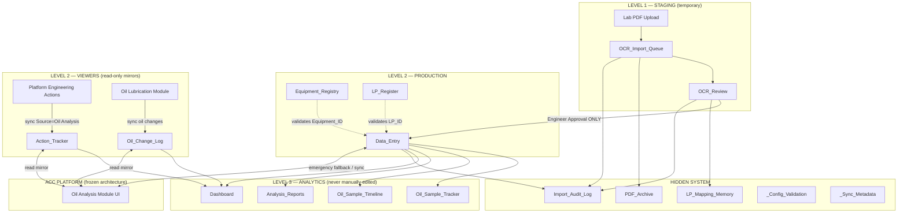
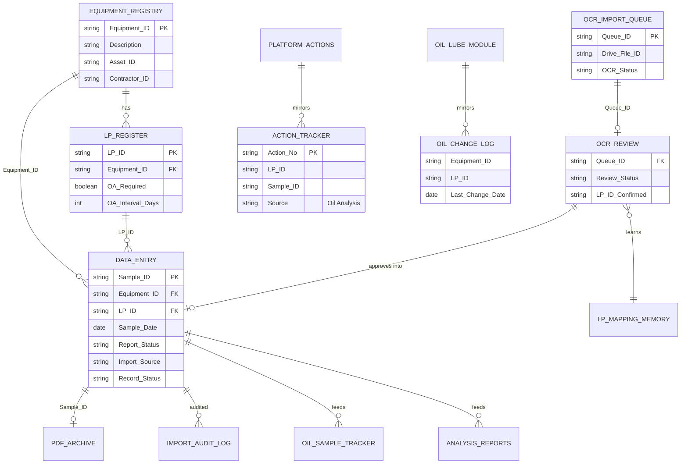

# Oil Analysis Database Workbook V2 — Relationship & Data Flow Diagram

**Document:** `WORKBOOK_RELATIONSHIP_DIAGRAM.md`  
**Status:** Design Draft for Review  
**Date:** 2026-07-05  
**Companion:** `OIL_ANALYSIS_DATABASE_WORKBOOK_V2_PROPOSAL.md`

---

## 1. Three-Level Architecture



---

## 2. Primary Data Flow — PDF / OCR Path

```text
┌─────────────┐
│  Lab PDF    │  Mobil / lab report (may contain 5 trend columns)
└──────┬──────┘
       │ upload (future: App or Apps Script)
       ▼
┌─────────────────────┐
│  OCR_Import_Queue   │  Raw extract + metadata. Status: Queued/Extracted/Failed
│  (LEVEL 1 — hidden) │
└──────┬──────────────┘
       │ engineer opens OCR_Review
       ▼
┌─────────────────────┐     suggest LP_ID from
│  OCR_Review         │◄──── LP_Mapping_Memory
│  (LEVEL 1 — visible)│
└──────┬──────────────┘
       │ Approve / Reject / Skip
       │ (ONLY latest sample column imported per PDF)
       ▼
┌─────────────────────┐     append event
│  Data_Entry         │────► Import_Audit_Log (Approved)
│  (LEVEL 2 — PROD)   │
└──────┬──────────────┘
       │ formula references
       ▼
┌──────────────────────────────────────────┐
│  Oil_Sample_Tracker                      │
│  Oil_Sample_Timeline                     │
│  Analysis_Reports                        │
│  Dashboard                               │
│  (LEVEL 3 — ANALYTICS)                   │
└──────┬───────────────────────────────────┘
       │ optional sync when platform available
       ▼
┌─────────────────────┐
│  Oil Analysis App   │
└─────────────────────┘
```

**Hard rule:** OCR_Import_Queue and OCR_Review **never** write directly to `Data_Entry`. Promotion requires explicit engineer approval recorded in `Import_Audit_Log`.

---

## 3. Manual Emergency Path (No App / No OCR / No Drive)

```text
Engineer
   │
   │ enters row directly
   ▼
Data_Entry  (Import_Source = "manual")
   │
   ├──► Oil_Sample_Tracker / Timeline / Reports / Dashboard  (formulas refresh)
   │
   └──► Import_Audit_Log  (Event_Type = "Manual_Entry" — optional Apps Script stamp)

Equipment_ID validated against Equipment_Registry
LP_ID validated against LP_Register (or left blank with engineer note during transition)
```

---

## 4. Entity Relationship Diagram



---

## 5. Identity Key Relationships

| Key | Role | Master Owner | Workbook Role |
|-----|------|--------------|---------------|
| `Equipment_ID` | Physical asset | Platform Equipment Registry | `Equipment_Registry` reference + `Data_Entry` FK |
| `LP_ID` | Lubrication / sampling point | Oil Lubrication Module | `LP_Register` reference + `Data_Entry` FK |
| `Sample_ID` | Lab sample / report | Oil Analysis (app DB) | `Data_Entry` PK (unique per active record) |
| `Action_No` | Engineering action | Platform Engineering Actions | `Action_Tracker` viewer only |
| `Queue_ID` | OCR batch item | Workbook staging | `OCR_Import_Queue` → `OCR_Review` |

---

## 6. Cross-Module Integration (Future)

```text
                    ┌─────────────────────────┐
                    │   ACC Platform          │
                    └───────────┬─────────────┘
          ┌─────────────────────┼─────────────────────┐
          ▼                     ▼                     ▼
   Equipment Registry    Oil Lubrication        Engineering Actions
          │                     │                     │
          │                     │ OilChangeCompleted  │ Source=Oil Analysis
          ▼                     ▼                     ▼
   Equipment_Registry      Oil_Change_Log         Action_Tracker
   LP_Register                  │                     │
          │                     │                     │
          └──────────┬──────────┴──────────┬──────────┘
                     ▼                     ▼
               Data_Entry  ◄──────►  Oil Analysis App UI
                     │
              Google Drive PDF storage
                     │
               PDF_Archive (metadata)
```

---

## 7. Sheet Dependency Matrix

| Sheet | Depends On | Depended On By |
|-------|-----------|----------------|
| `OCR_Import_Queue` | PDF upload | `OCR_Review`, `PDF_Archive`, `Import_Audit_Log` |
| `OCR_Review` | `OCR_Import_Queue`, `LP_Mapping_Memory`, `Equipment_Registry`, `LP_Register` | `Data_Entry`, `Import_Audit_Log` |
| `Data_Entry` | `Equipment_Registry`, `LP_Register`, `OCR_Review` (optional) | All L3 analytics sheets, App sync |
| `Equipment_Registry` | Platform / manual | `Data_Entry`, `OCR_Review`, `LP_Register` |
| `LP_Register` | Oil Lubrication / Platform | `Data_Entry`, `OCR_Review` |
| `Action_Tracker` | Platform Engineering Actions | `Dashboard`, `Analysis_Reports` |
| `Oil_Change_Log` | Oil Lubrication Module | `Dashboard`, `Analysis_Reports` |
| `Oil_Sample_Tracker` | `Data_Entry` | `Dashboard` |
| `Oil_Sample_Timeline` | `Data_Entry`, `LP_Register` | `Dashboard` |
| `Analysis_Reports` | `Data_Entry`, `Action_Tracker`, `Oil_Change_Log` | — |
| `Dashboard` | `Data_Entry`, `Action_Tracker`, `Oil_Change_Log` | — |
| `LP_Mapping_Memory` | Engineer confirmation in `OCR_Review` | `OCR_Review` suggestions |
| `PDF_Archive` | Drive upload | `Data_Entry` (PDF_File_ID link) |
| `Import_Audit_Log` | All import events | Compliance / audit |

---

## 8. V1 → V2 Sheet Mapping

| V1 Sheet | V2 Destination | Notes |
|----------|----------------|-------|
| `Data_Entry` | `Data_Entry` | Extended columns; remains sole production table |
| `Data Entry_BD` | Archive migration → `Data_Entry` | Retire duplicate; use `Record_Status` + audit log |
| `Equipment Registry` | `Equipment_Registry` | Extended; add Contractor, Criticality |
| *(none)* | `LP_Register` | New — aligns with OA-001 UI |
| `Oil Sample Tracker` | `Oil_Sample_Tracker` | LP_ID rows instead of Equipment-only |
| `Oil Sample Tracker 1` | `Oil_Sample_Timeline` | Interval compliance |
| `📊Analysis Reports` | `Analysis_Reports` | Formula-driven; no manual cell editing |
| `Sheet1` (Dashboard) | `Dashboard` | KPI formulas from L3 engine |
| `Analysis Report` (hidden) | Retired / merged | Legacy calc sheet absorbed into `Analysis_Reports` |
| `Action Tracker` | `Action_Tracker` | Read-only viewer; aligned to Platform Action_No |
| `Oil Change Log` | `Oil_Change_Log` | Read-only viewer; LP_ID added |
| *(none)* | `OCR_Import_Queue`, `OCR_Review`, `LP_Mapping_Memory`, `PDF_Archive`, `Import_Audit_Log` | New staging & audit |
| *(none)* | `README`, `_Config_Validation`, `_Sync_Metadata` | Operations support |

---

## 9. Duplicate Sample Handling Flow

```text
OCR extracts Sample_ID
        │
        ▼
Exists in Data_Entry? ──No──► OCR_Review (normal)
        │
       Yes
        ▼
Import_Audit_Log: Duplicate_Detected
        │
   ┌────┴────┬──────────┐
   ▼         ▼          ▼
 Skip    Overwrite   Manual Review
   │         │          │
   │         │          └──► OCR_Review (Pending)
   │         │
   │         └──► Data_Entry Row_Version + 1
   │              Import_Audit_Log: Overwritten
   │
   └──► Import_Audit_Log: Skipped
```

---

*End of relationship diagram — for implementation approval only.*
